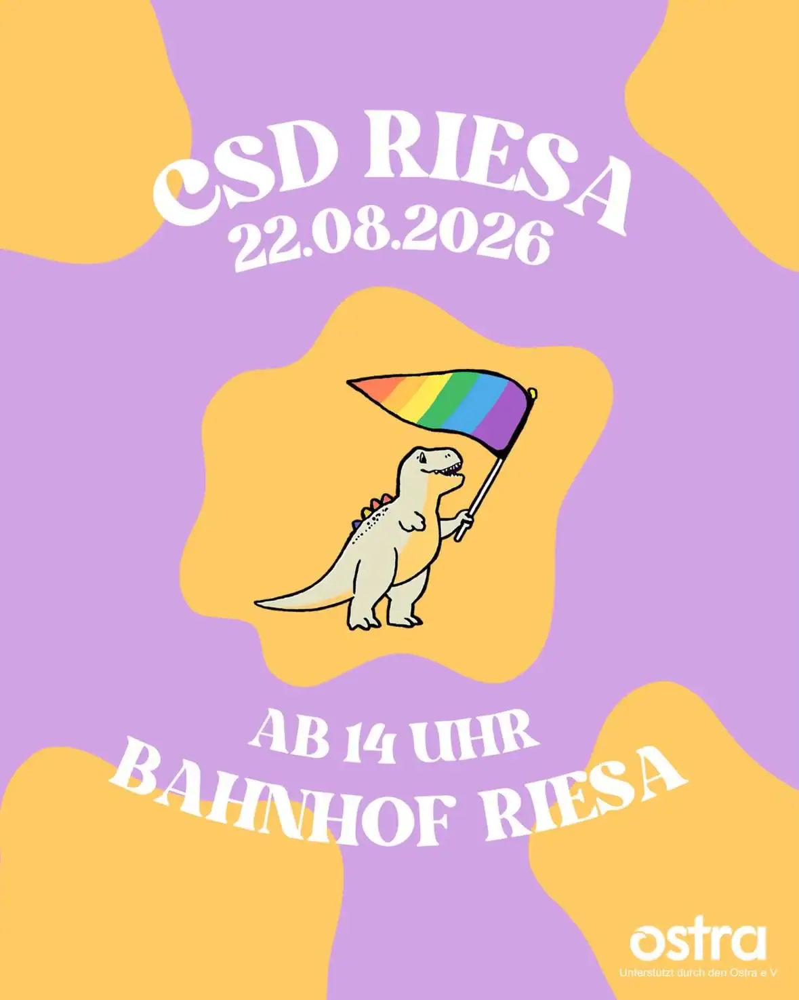
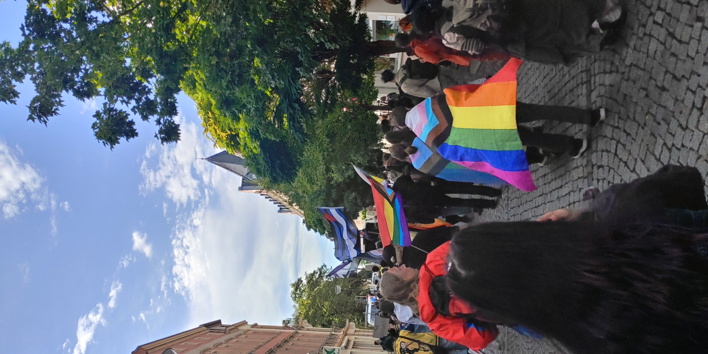

+++
title = 'CSD Riesa'
description = 'I was at the CSD Riesa and you should be there too next year!'
date = 2026-08-23
tags = [
  'travel blog',
]
+++

Last saturday (22.08.2026) I was in Riesa together with a friend for the CSD (Christopher Street Day). Originally I planned to get there with two other friends, but one got sick and the other got a visit by his mother. The CSD is a european celebration and demonstration of LGBTQ+ rights. Riesa is a larger city between Leipzig and Dresden. This location is especially important for the CSB, because of the rise of the far right in East Germany and especially Saxony.

We started around 12 AM in Leipzig and took the train RE50 to Dresden. After around 45 minutes, we arrived in Riesa. Because the demonstration only started at 2 PM, we started to walk a bit around the city center.
The demonstration itself started at the main train station, then continued to the city marketplace through the historical city center and then ended again at the train station. The weather was okay-ish: it was a bit cold and you couldn't see the sun, but at the very least it wasn't raining or above 30°.

So we started walking through the city. We had a sound carriage with us that we followed. After around an hour, we reached the city marketplace and did a thirty minute break. During the break there was a little dance activity planned that looked interesting but in which neither I nor any of my friends participated. Then we started to get moving again to the city center this time. When we arrived there, we got a free vegan doner and listened to multiple different speeches related to the CSD. After all speeches and an all the food was distributed, we returned to the train station and the ended the demonstration. During the complete demonstration, everyone was friendly and peaceful. There were some strange people on the side lines that tried to disrupt the demonstration, but nothing noteworthy happened.

