+++
title = '''Dopsball Report: WiSe 2025/2026 Part 1'''
description = 'The great meme rewind for the subreddit r\dopsball is here!'
date = 2026-05-14
tags = [
  'leipzig',
  'dopsball',
]
+++

Dopsball is a reddit community that posts memes over the computer science department of my university. Over the years, especially in the last semester, some of the greates memes were created here. This is me commenting and reviewing every single meme that was posted there during the winter semester 2025/26. Because there were so many memes posted by fellow students, I decided to split this meme compilation into two parts. The first part that you are currently reading covers all posts from 01/10/2025 to 14/02/2026, were the second covers all from 15/02/2026 to 01/04/2026.

## Some statistics first

There was a total of 53 memes posted in the subreddit from 01/10/2025 to 01/04/2026. From the 53 memes created, 50 were images, 3 were videos and 0 were text based. The first meme was posted on 14/10/2025 and the last on 28/03/2026. The most memes were posted on 20/02/2026 with a total of 12 memes. The top tree most upvoted memes in this time were "Amen" from user u/Jannicek, "Ist halt einfach viel übersichtlicher" from u/Upscairs and a meme compilation from u/Haminopulus called "Nach der Klausurenpsychose ist vor der Klausurenpsychose".

## October

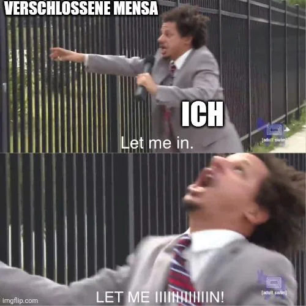

For every student, the main source of food and nutrition is obviously the mensa. And if it's closed, you are ~~going to die~~ very sad.



---

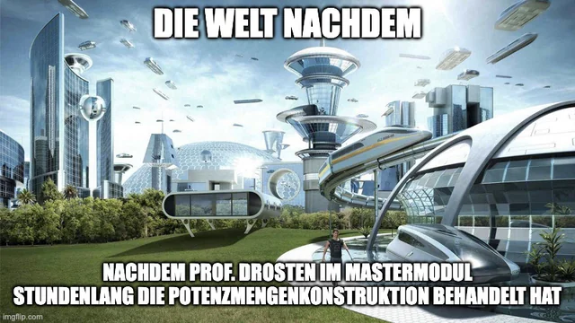

Who is Drosten? Why did he covered the _>Insert simple topic already covered in the bachelor<_ in a master module? Who knows? Who cares? Let's just continue!



---

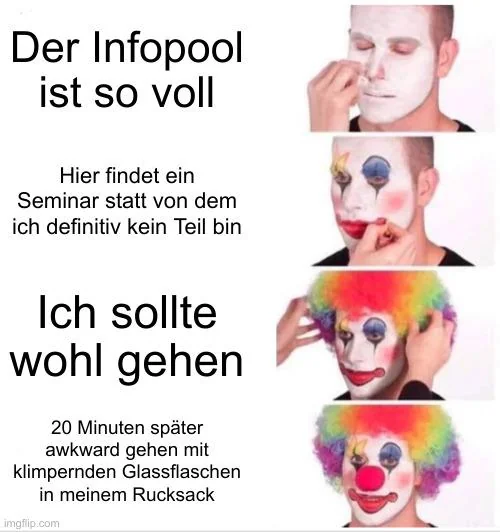

In between, there was a module - I think it was journalism - held in the open informatics room. Three questions are on my mind:

1) Why was this module held in the information room in the first place?
2) Why wasn’t it held there anymore halfway through the semester?
3) What do I need to do to enroll in it?

Honestly, the module looked really interesting and was more practical than most modules in computer science



---

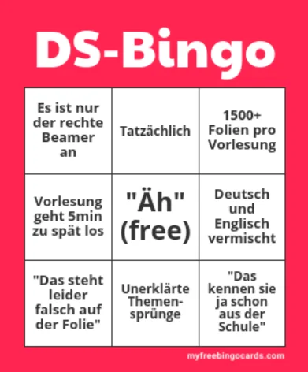

The DS bingo is a lie, because everyone knows that 5 minutes to late is way to early for Grabowsky. This meme will start a new era of Grabowsky memes that will escalate into a wide spread psychosis.



## November

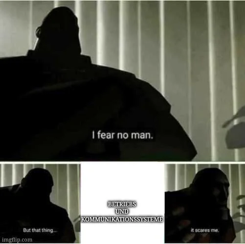

Lindemann instills fear and hatred among the students. He and his courses are feared - and rightly so. Stay alert, or else Lindemann will visit you in your sleep and recite outdated knowledge about communication systems in a slow, monotonous voice. And what the hell was that operating systems section in this course? Did it even exist? Is its existence just a lie?



## December

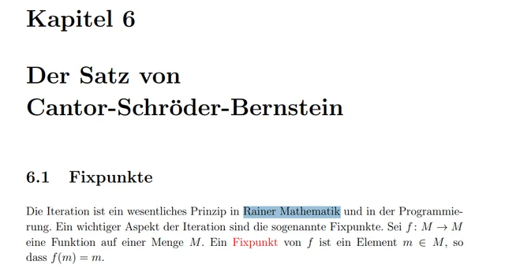

This is just a funny typo from Kirchheim's calculus script.



## January

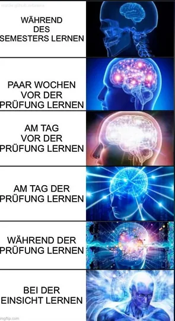

Don't start trying to study for an exam as early as possible. Instead, try to put off studying by just one day each day. By the time the exam is over, there will still be plenty of time to have an epiphany.

This was the single most upvoted meme in this semester.



---

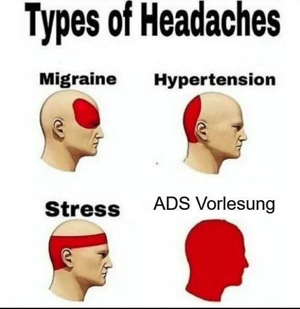

ADS (algorithms and data structures) can be intense. On the other side, I really enjoiyed Prof. Stadtlers humor and Dr. Gatters lecture style.



---

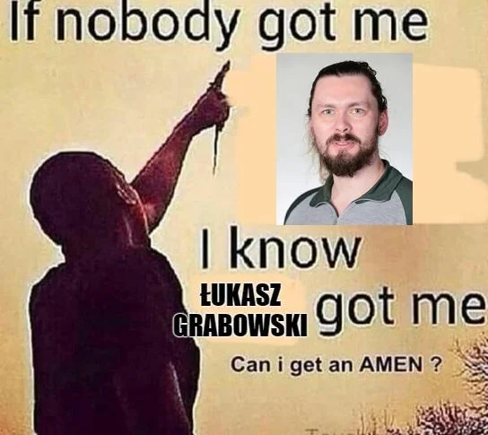

Let's praise Grabowsky! Amen.



---

Welcome to the first and last pun of the semester. Today we’re featuring: Couchy Kriterium



---

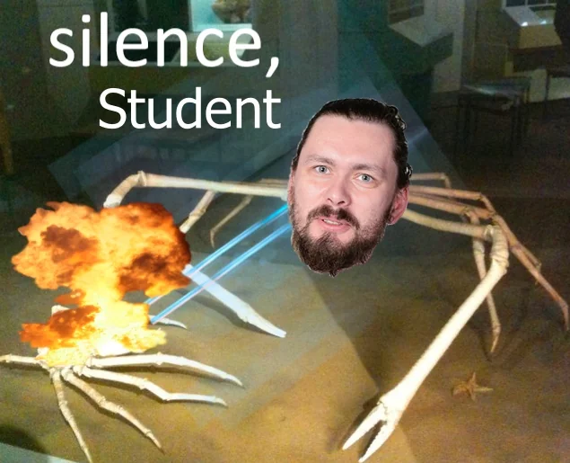

That's a pretty neat version of the "silence, brand" meme. I love it!



---

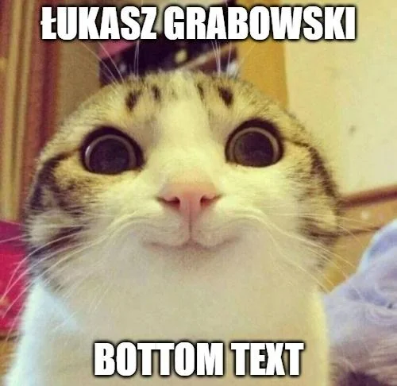

Did I miss something? Grabowsky rarely had interesting footnotes.



---

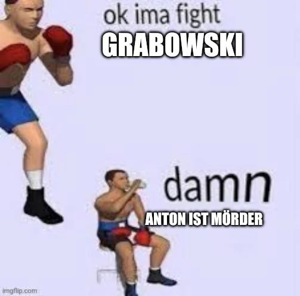

This is the first but far away from being the last "Anton ist Mörder" meme. There were so many posts that covered this exact phrase that it got a bit exausting.



## February

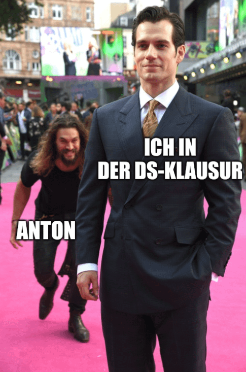

The title was "2 ist eine Primzahl gdw. 2 + 2 = 5". Looking in retroperspective, that's were the Grabowsky psychosis really started.



---



Grabowsky always shows up whenever he feels like it. He's never on time and is often at least 15 minutes late.



---

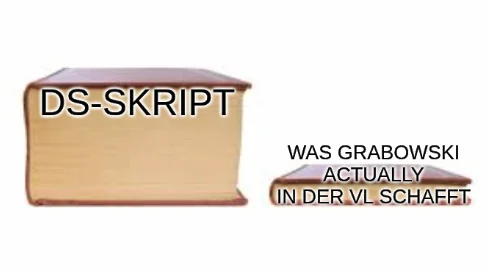

Grabowsky is really slow when it comes to his lectures. He does not cover a lot of his own script, but honestly I think that's ok!



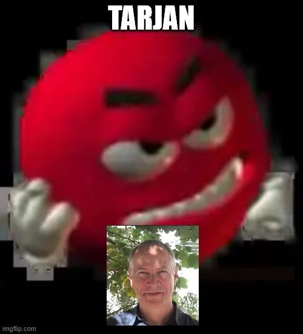

Tarjan has created a pretty cool algorithm. Unfortunately, it’s us who have to write this algorithm out by hand on a sheet of paper under time pressure during the exam.



---



The title "20.000 Folien im Semester reichen dann ja auch" references Grabowsky's presentations, were every single word has its own animation.



---

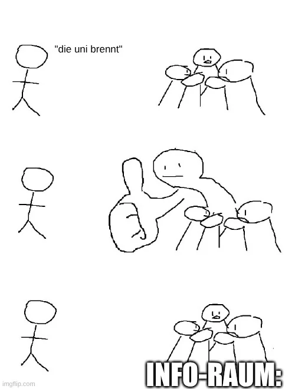

The title "Glas ist feuerfest gdw. Glas ist in Uni Leipzig" references Grabowskys module DS. Do I still need to state that something references Grabowsky? At this point, you can just assume it as the default! I think this meme was created after the second false fire alarm.



---

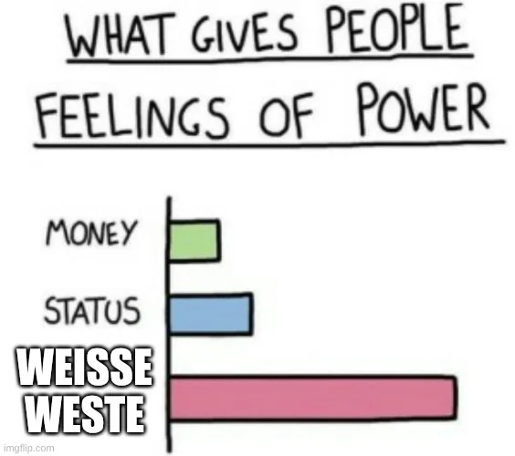

What's the deal with the “clean slate”? Apparently, someone mentioned a “clean slate” on Grabowsky's show at some point, and now it keeps getting reposted over and over again. There's no deeper meaning to it. It's basically r/Dopsball's own brainrot meme.



---

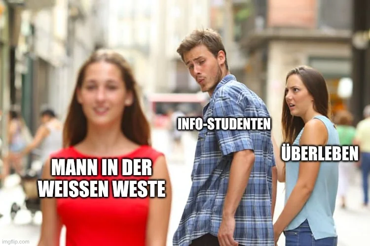

Another clean slate brainrot meme.



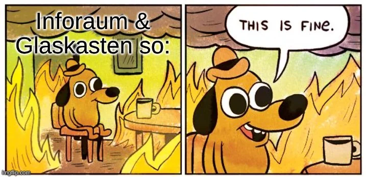

Someone figured it wouldn't be a problem if the fire alarm could only be heard in the stairwell. If you're sitting in the open information room instead, you can't even hear the alarm. Is this safe? No. Do we still stay in the university building even when the alarm goes off? Yes!



---

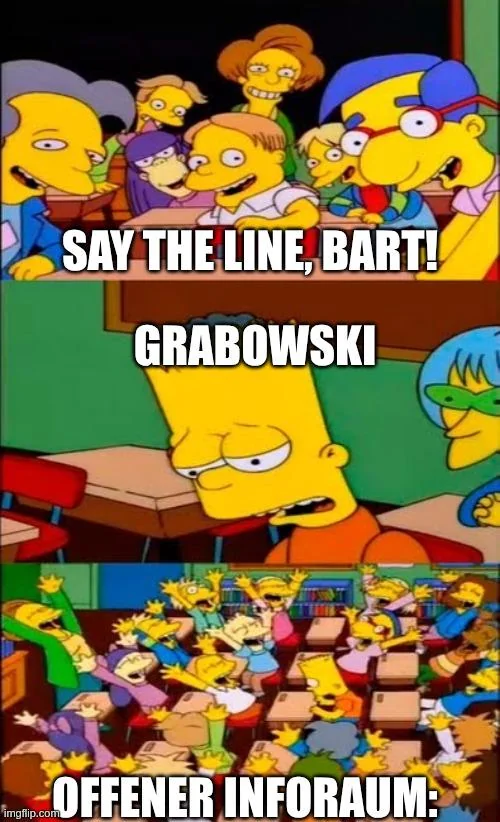

Sometimes, self-reflection hits really hard. And at these times, all you need to hear is "Grabowsky", only to realize that you've gotten a little closer to psychosis.



---

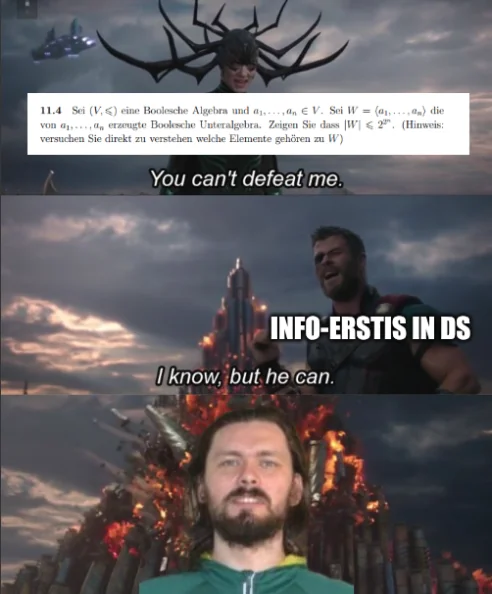

Grabowsky ... Grabowsky ... Grabowsky ...



That was the last meme for the first part posted on 12/02/2026. The second part will be available in a few days.
