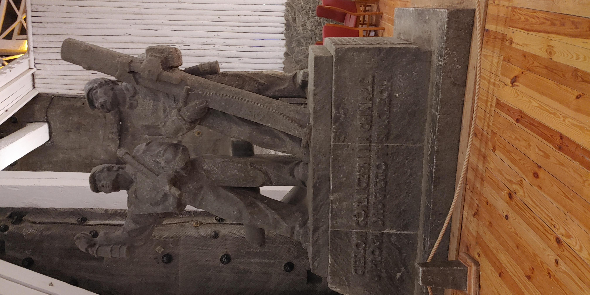
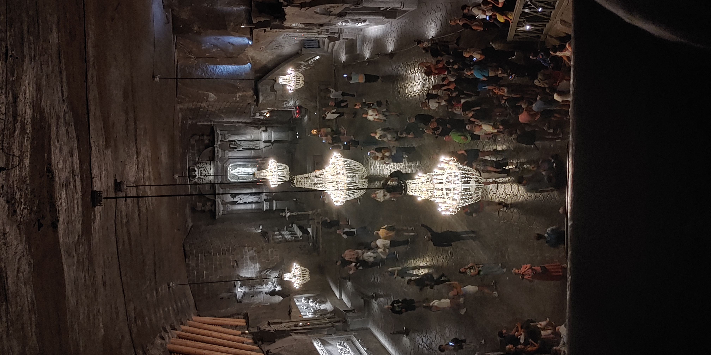
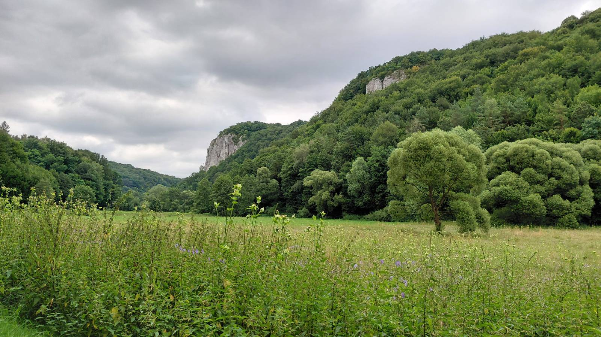
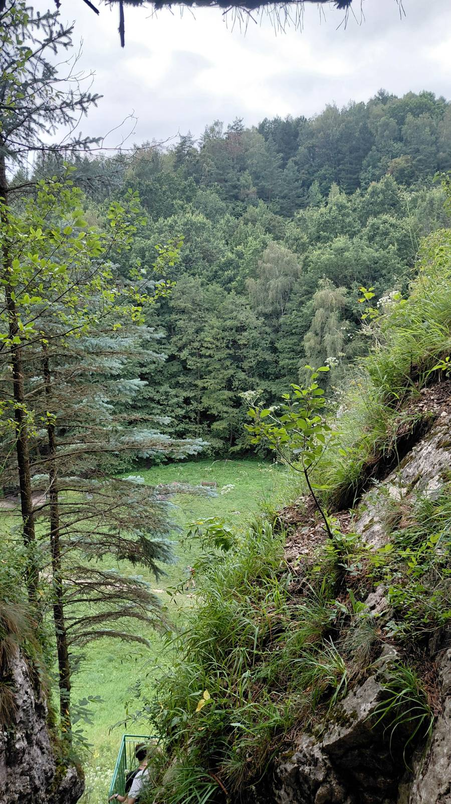
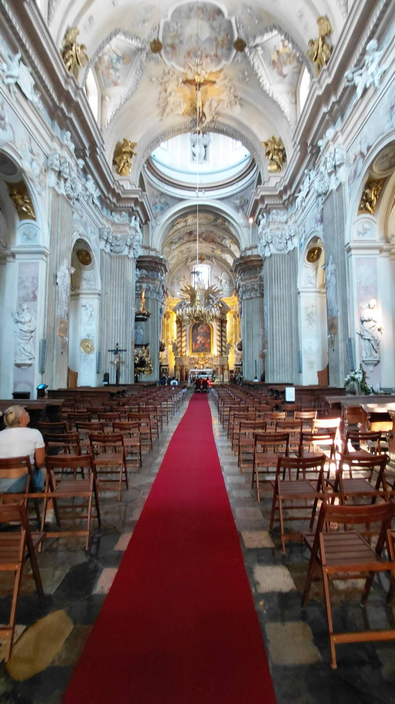
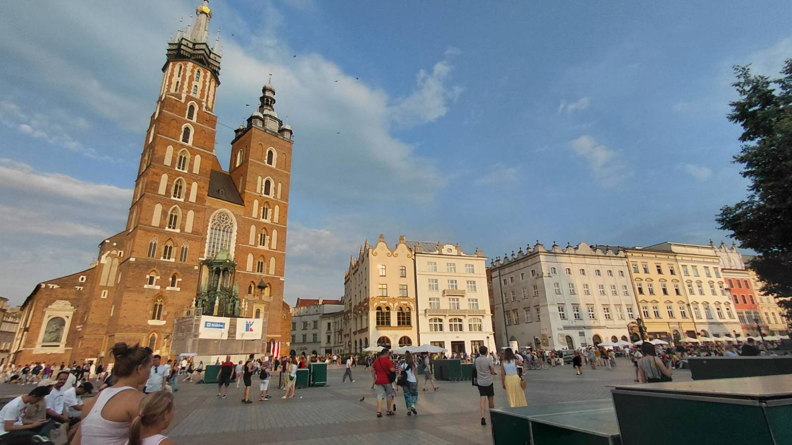
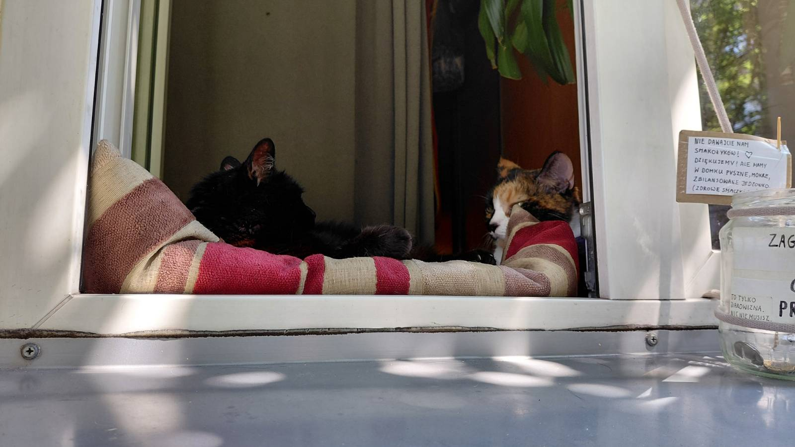

+++
title = 'Travel Blog: Kraków'
description = 'I traveled to Poland and Czechia over ten days together with a friend.'
date = 2026-08-21
tags = [
  'travel blog',
  'poland & czechia'
]
+++

## Salt Mine

We first visited the [salt mine in Wieliczka](https://www.wieliczka-saltmine.com/) on friday. This salt mine was really huge and covered multiple square kilometers. They offered to guided tours: the first one was a tourist tour were you would see the most popular places, the second one the miners tour were you would get miner equipment and take a route that you wouldn't normally see. We decided to take the first option.

Because miners were really religious – our guide emphasized this fact multiple times – there were also a lot of churches and capella's inside the mine. We saw seven churches just on our tour, and there were a lot more we couldn't see or that got destroyed over time.

## Hiking

This time we tried the [following route](https://www.alltrails.com/trail/poland/lesser-poland-malopolskie/dolina-kobylanska-i-dolina-bedkowska), which was a bit more outside. To get there, we first needed to take the bus which took about 50 minutes. The public transportation system was really good. We needed to install an app to pay for our tickets, which was easy except for the language barrier. One of the small issues we noticed was that you can not directly pay for the tickets, but instead you need to charge up your account with there in app currency and only then can pay for it.

For most of the time, we didn't met any one. The weather was good and the view was also really beautiful. During our hike, we noticed that there were a lot of climbers at the cliffs.

Later on our way back, we noticed a small cave at one of the cliffs. This is the view from the top:

## Even more of Churches and Basilicas

Poland in general is a deeply christian country with a lot of churches. On a single market place, we could often see two or even three churches side by side. This one was a relatively small one that we noticed on our way to the city center:

At the historical city market are multiple iconic buildings. One of them was the basilica which you can see on the picture. Unfortunately, it was under renovation and closed of for tourists. The view from the outside was still magnificent. There were also a lot of pigeons on the market that even good feed by tourist. It looked like the pigeons were some kind of local attraction. Later we bought a matching pair of socks that depicted capybaras, because capybaras in generally are just really cute.

## Auschwitz

In school we already visited Buchenwald and I always wanted to visit the KZ Auschwitz too. We needed to take the train from Kraków which took us around one hour. The tain we took looked really old and didn't had any air conditioners at all, but this could maybe be the case because we took one of the cheaper options. When we later took the train to Praha, our experience was much better.
Another problem was that you could book the tickets online for free, but you still were required to make a reservation. Because we booked a bit to late, there weren't hardly any free slots left and needed to take one at the afternoon. Therefore we hadn't that much time and needed to hurry.

When we arrived at the train station, we still needed to walk for around 20 minutes to KZ Auschwitz. There was a security check at the entry that we passed quickly. The atmosphere was just as dark as expected. The visitor path started with a long brutalistic corridor in which the names of the victims were repeated over and over again. Inside the KZ itself were a lot of the original buildings preserved. All information was available in polish, english and hebraic. Many information was already well known from history lessons, but it was quite different to see it directly.
Out of respect for the victims, we didn't took any pictures. If you want to see some, please take a look at there website.

## Art Museum

One of my favorite places that we visited where the art museum. The classical european art didn't really catch me, because I have seen similar ones before in Germany or in Wroclaw. What was way more interesting was there exhibit of modern arts. Unfortunately, we decided to start from the bottom to the top and the modern arts were at the very top. Because we were short of time and still stayed till the museum closed for over four hours, even then we were not able to view everything.

Buy the way, did you realized how horrifyingly bloody most greek stories are? They start something like: man or women does something. The gods don't like it. Everyone dies.

## Highest rated attraction

Did you know, what the highest rated attraction in Kraków is? It's cats! We walked around the city the a small cafe, where we played chess and drank coffee. I won't tell you who won! There is a open window directly next to the street from which you can see the cats and if you are lucky, you can even pet them. Just look at them! Aren't they cute?

## The Jacob thing

In the evenings, we watched and completed Twilight. Theses films were... interesting, I suppose? Personally I found the ending of the second part of the fourth book really bad, but it wasn't like the hole saga wasn't already highly toxic, so what does a single bad ending do for a difference? I got Vampire Suck recommended, but didn't got the time to watch it yet. What I got the time for was to read some fan fictions to Edward and Jacob. You all need to read [Jedward](https://archiveofourown.org/works/28150575)!

Another great revelation was to learn the fundamental truth about the universe, which can be explained by the following formula:

Jacob = Hot (You know if you know.)
