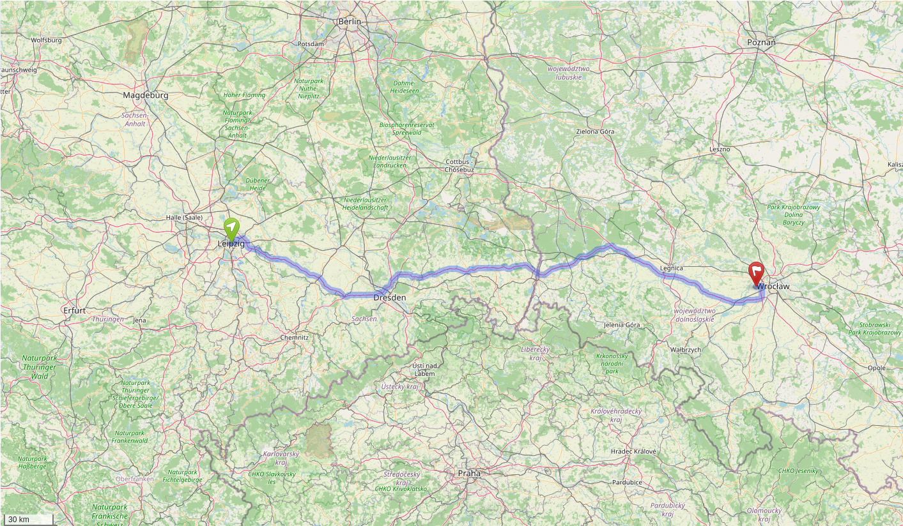
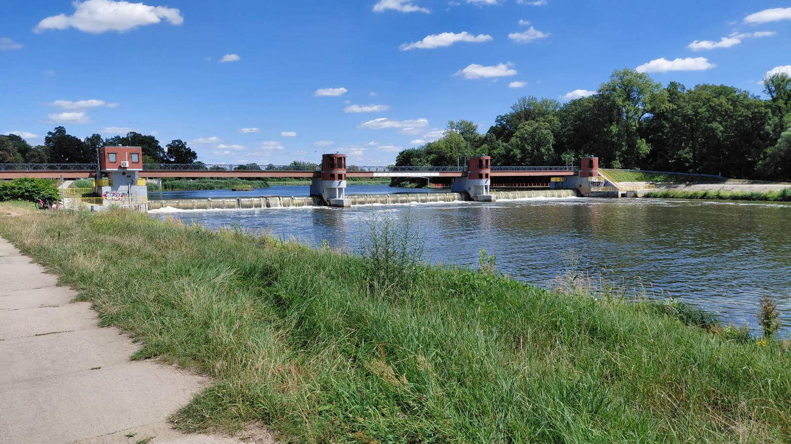
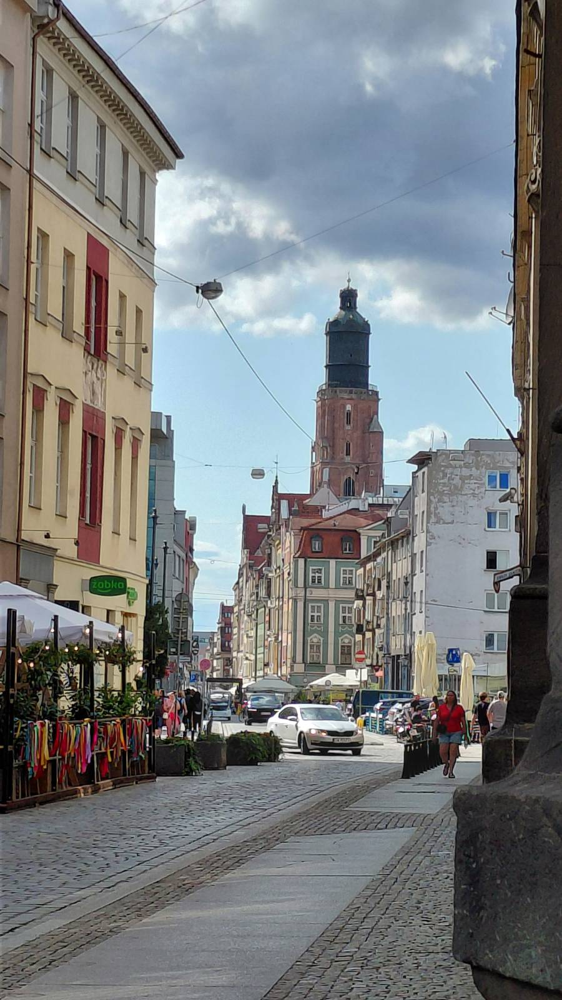
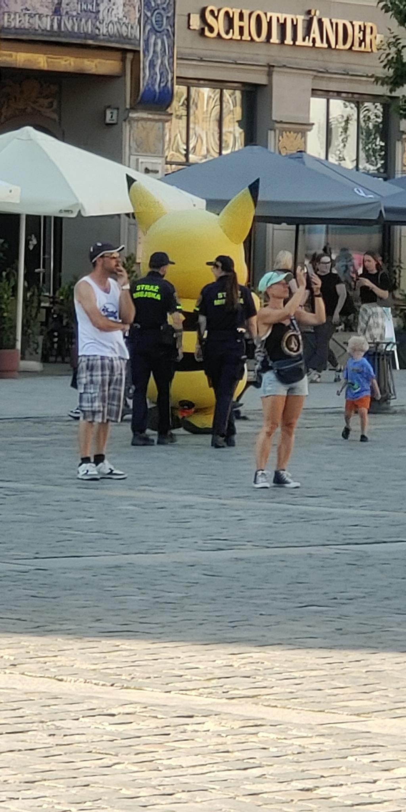
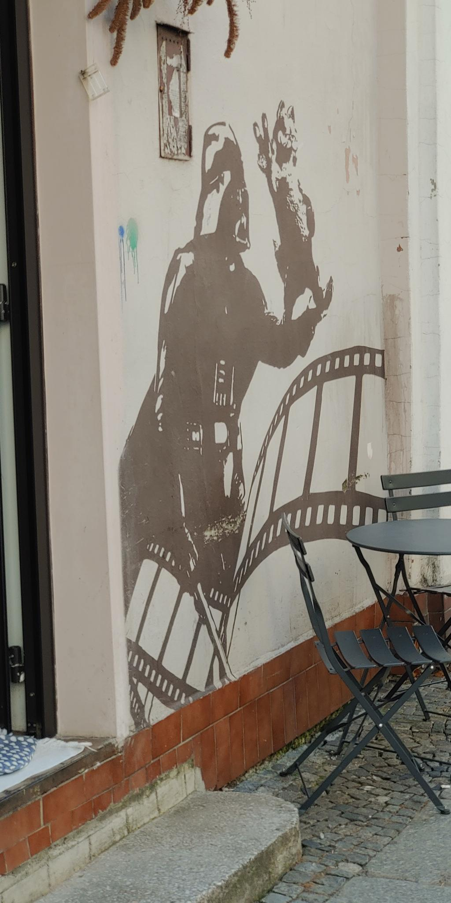
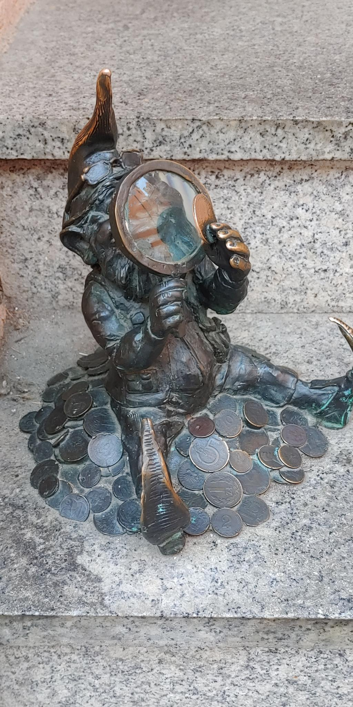

+++
title = 'Travel Blog: Wrocław'
description = 'I traveled to Poland and Czechia over ten days together with a friend.'
date = 2026-08-20
tags = [
  'travel blog',
  'poland & czechia'
]
+++

## Our travel plan

We started our tour in Leipzig, Germany. We planned a round trip trough Wrocław, Kraków and Praha. We mostly wanted to travel via Flix Bus because it was cheep and stayed in hospitals for the same reason. We didn't speak the language nor had any cash prepared. Both Poland and Czechia are in the EU, but not in the euro zone and therefore have there own currency.

## Hiking

We started hiking at the next day. We picked out a route that was nearby, wasn't that long but also not to short. Little reminder that if you go hiking, always bring enough water and food with you! Because we had plenty of time, we decided to start the route from the hostel. The hike started it the city and then followed a river. We walked around an island and then back to the city. During our hike we spotted multiple dam's that were interesting. The weather was perfect and the route itself quite similar to gera

## City center

The city center with its old buildings was really beautiful. You could easily walk everywhere and the bus system was really good.

At the marketplace, something funny happened: the police checked the personal details of some mascots. Because one of the mascots were pikachu, we could see him getting arrested.

There was also a pretty good wall painting of Darth Vader from Star Wars episode 5: "the empire strikes back". It was from the scene where vader told luke that he is his father. The painting but Garfield (the cat) on Vader's hand.

## National Museum

We later arrived at the national museum. They had a lot of medieval art displayed. One of the fascinating things were, that the text on a lot of pictures were written in German, because Prussia controlled this area at the time. Most of the artworks were related to christianity. They even displayed an old church bell.

## Dwarf Hunting

Wrocław is well known for there dwarfs. There are a lot of dwarfs everywhere and they are supposed to bring good luck. We started a little competition that whenever you spotted a dwarf, you were allowed to give the other one a friendly hit. It was quite similar to spotting yellow cars. Furthermore, this started a debate what was considered a true "dwarf" and what not.

## Fascination for Zabkas

Poland has a lot of convenient stores. The chain is called Zabka and they are literally everywhere. In one street we could see four of them from the same chain at the same time.
